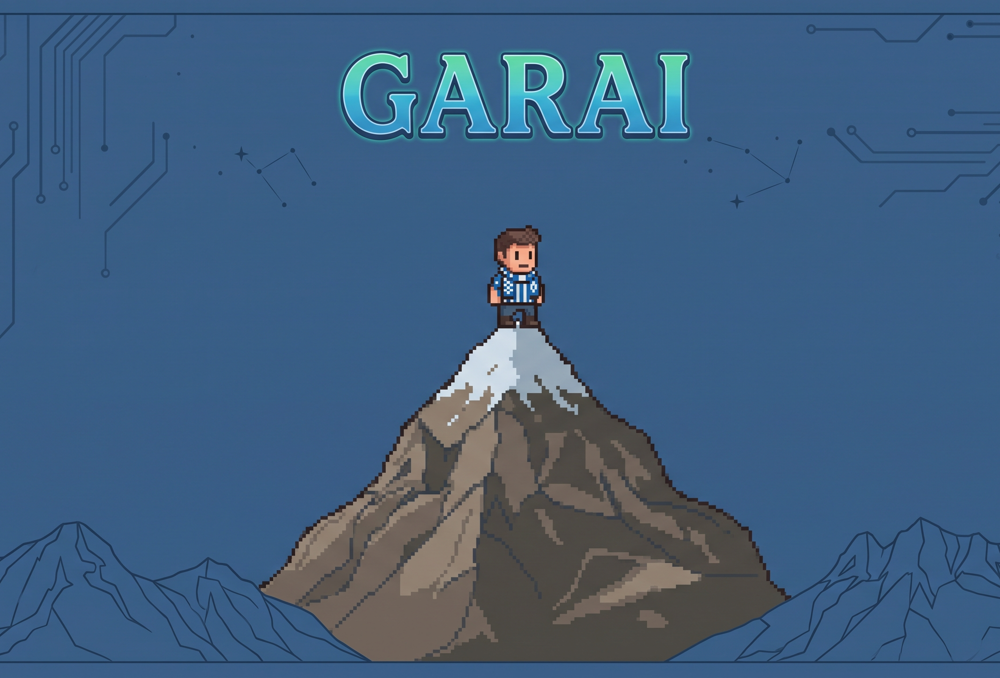

  

## 👋 ¡Hola! Soy Garai Martínez de Santos Gómez

Soy estudiante de ingeniería e investigador en formación. Me gusta cacharrear con datos, hardware y software para buscar soluciones que sirvan en el mundo real, conectando lo industrial y lo informático.

 

| De dónde vengo | Qué hago ahora | Hacia dónde voy |
| --- | --- | --- |
| **Graduado en Industria Digital**  Universidad de Deusto | **Investigador en formación Dual**  Tecnalia | **Máster en Computación y Sistemas Inteligentes**  Empezando |

 
 

### 👨‍💻 A qué me dedico

Gracias a la carrera he tocado un poco de todo y eso es justo lo que me gusta. Prefiero tener la visión completa de un proyecto, desde picar código hasta ver cómo funciona la máquina en la fábrica.

📂 Lo que más me gusta hacer (Despliega para ver más)

 

| Tema | Qué es lo que hago |
| --- | --- |
| **IoT Industrial y Edge computing** | Conectar máquinas y sacar datos útiles |
| **IA y Mantenimiento Preventivo y Predictivo** | Usar datos para darles una utilidad real |
| **Arquitecturas de datos** | Montar la base para que la información fluya bien |
| **Desarrollo versátil** | Adaptarme a la tecnología que haga falta en cada momento |

 
 

### 🕹️ Cuando apago el ordenador

No todo va a ser estar delante de una pantalla. Mis aficiones son mi forma de recargar pilas y mantener el foco.

🏔️ Montaña y hierros

 

Coronar cimas por el País Vasco y los Pirineos es mi mejor desconexión. En el pasado hice atletismo de alto rendimiento y esa disciplina me la llevo ahora a mis rutinas de fuerza en el gimnasio y a los proyectos del día a día.

*   Última ruta lograda: Subida al Aratz y al Aitzgorri

⚽ Otras aficiones

 

| **Deportivo Alavés** | **Universo Nintendo** | **Más cosas** |
| --- | --- | --- |
| Animando siempre en Mendizorroza | Jugando a los clásicos y esperando lo nuevo | Haciendo fotos, leyendo o ideando hamburguesas |

 
 

---